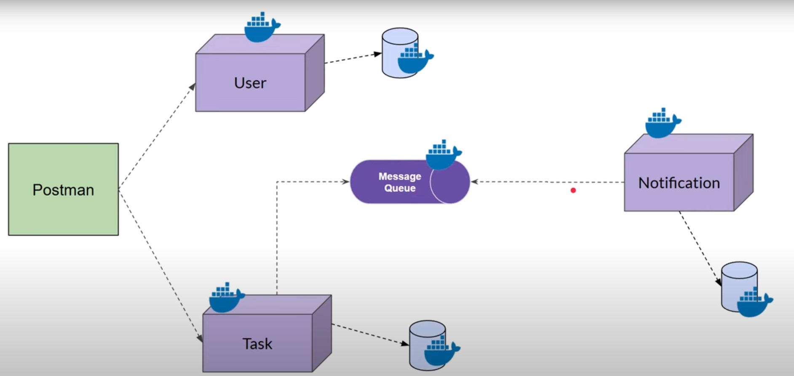

# Tecnologia utilizadas
## Node.js - Express
## Mongo - Mongoose
## RabbitMQ
## Docker

Para criar tudo a partir do docker-compose, na raiz do projeto execute:
```
docker-compose up --build -d
```

Isso vai gerar tudo que é necessário para a fila funcionar.

Os endpoints para testar estão na collection dentro da raiz do projeto.


# Diagrama dos Microsserviços
