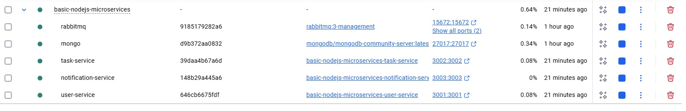

### 🛠️ Tecnologias Utilizadas

* **Node.js / Express:** Plataforma de runtime e framework web para construir as APIs.
* **MongoDB / Mongoose:** Banco de dados NoSQL e seu ODM para modelagem e persistência de dados.
* **RabbitMQ:** Message Broker (fila de mensagens) para o desacoplamento dos serviços.
* **Docker / Docker Compose:** Ferramentas para conteinerização e orquestração de todo o ambiente de desenvolvimento.

Para criar tudo a partir do docker-compose, na raiz do projeto execute:
```
docker-compose up --build -d
```

Isso vai gerar tudo que é necessário para a fila funcionar.

Os endpoints para testar estão na collection dentro da raiz do projeto.


### 🗺️ Diagrama dos Microsserviços


### Estrutura do container
